# Diagram Pharmalink (Mermaid)

Kode sumber diagram untuk dokumentasi/sidang. Render di GitHub/GitLab/Notion/mermaid.live yang mendukung Mermaid. Berasarkan implementasi aktual (bukan rencana) — lihat `docs/IMPLEMENTATION_PLAN.md`.

## 1. Use Case Diagram

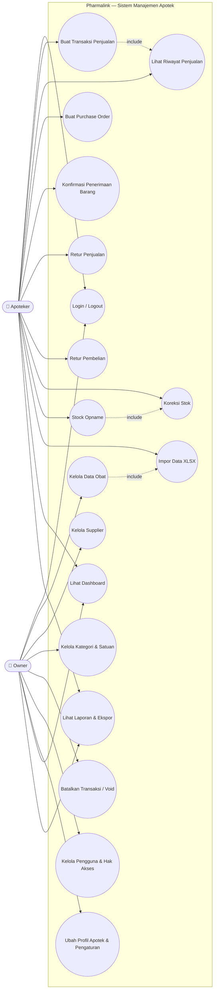

## 2. DFD Level 0 (Context Diagram)

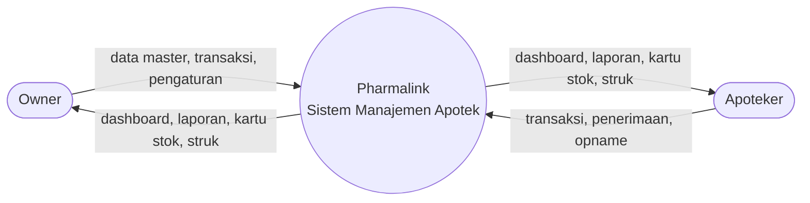

## 3. DFD Level 1

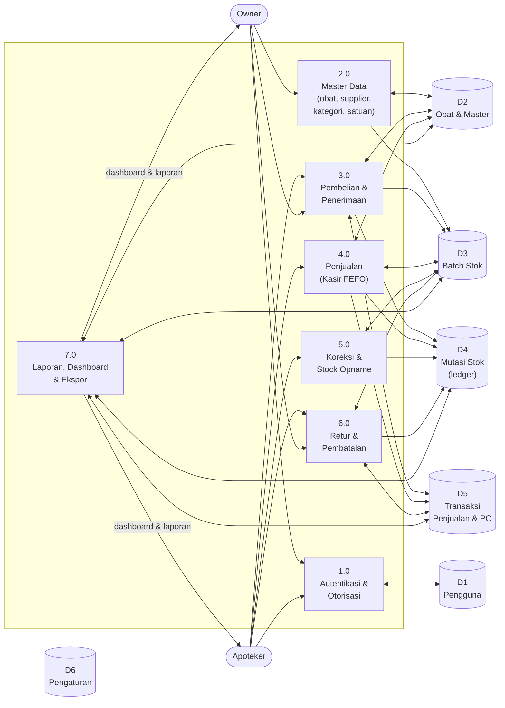

## 4. ERD

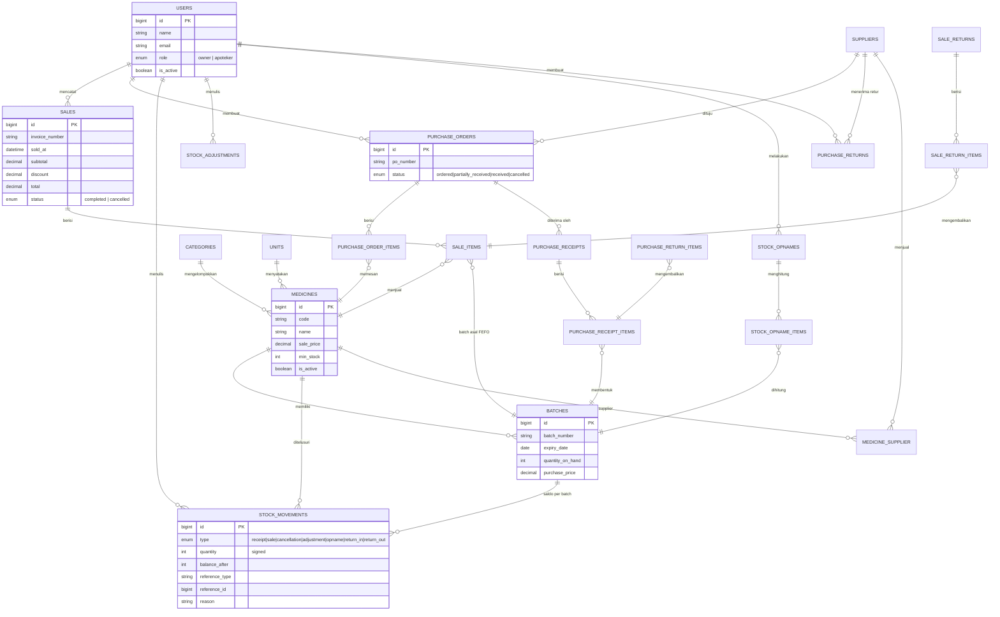

## 5. Flowchart — Penjualan (Kasir, FEFO)

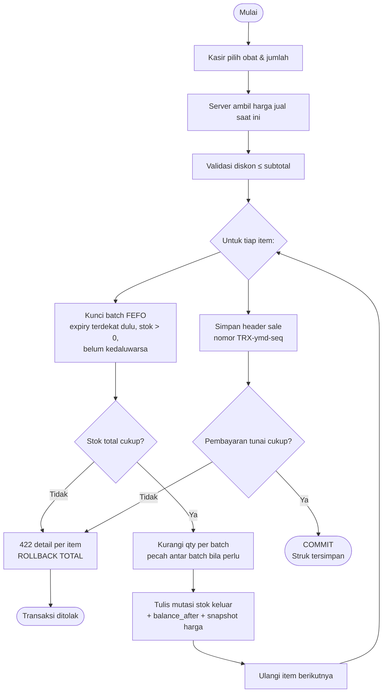

## 6. Flowchart — Penerimaan Barang dari PO

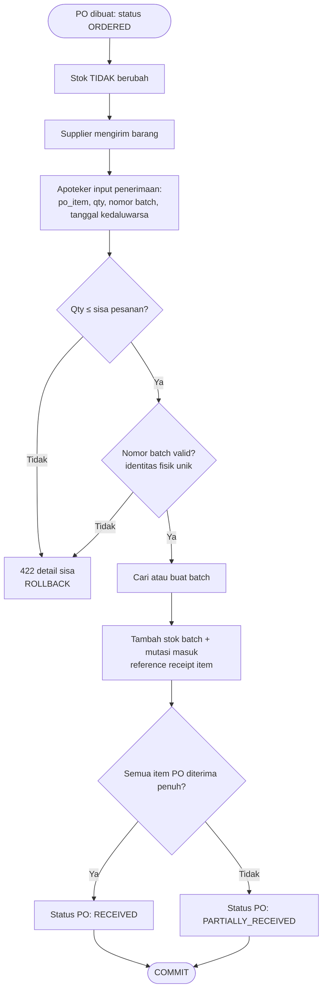

## 7. Activity Diagram — Stock Opname

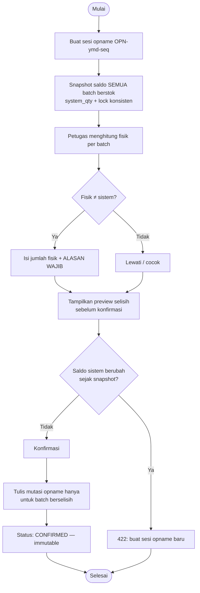

## 8. Sequence Diagram — Transaksi Penjualan

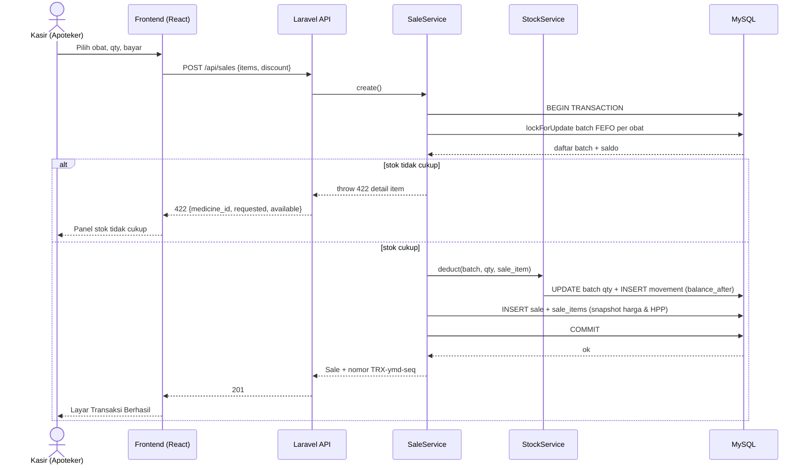

## 9. Class Diagram — Domain Backend (ringkas)

```mermaid
classDiagram
    class StockService {
        +add(Batch, qty, type, reference, reason)
        +deduct(Batch, qty, type, reference, reason)
        <<satu-satunya pintu ubah stok>>
    }
    class BatchService {
        +findOrCreateForReceipt(medicine, batchNo, expiry)
        <<nomor batch = identitas fisik>>
    }
    class SaleService {
        +create(items, discount) Sale
        <<FEFO, snapshot harga + cost_price>>
    }
    class PurchaseOrderService {
        +create(supplier, items) PurchaseOrder
    }
    class PurchaseService {
        +receive(po, items) PurchaseReceipt
    }
    class StockAdjustmentService {
        +create(batch, qty, reason)
    }
    class StockOpnameService {
        +create() StockOpname
        +updateCounts(counts)
        +confirm()
        <<diff dari saldo live>>
    }
    class SaleVoidService {
        +void(sale, reason)
        <<reversal ke batch asal, owner only>>
    }
    class SaleReturnService {
        +return(sale, items, reason)
    }
    class PurchaseReturnService {
        +create(items, reason)
        <<batas returnable per receipt item>>
    }
    class ReportService {
        +sales(period) +purchases(period)
        +stock() +expiry(days)
        +profitLoss(period)
    }

    SaleService --> StockService
    PurchaseService --> StockService
    PurchaseService --> BatchService
    PurchaseReceiptService --> BatchService
    PurchaseReturnService --> StockService
    StockAdjustmentService --> StockService
    StockOpnameService --> StockService
    SaleVoidService --> StockService
    SaleReturnService --> StockService
    ReportService --> Sale : baca snapshot
```

## 10. State Diagram — Status Dokumen

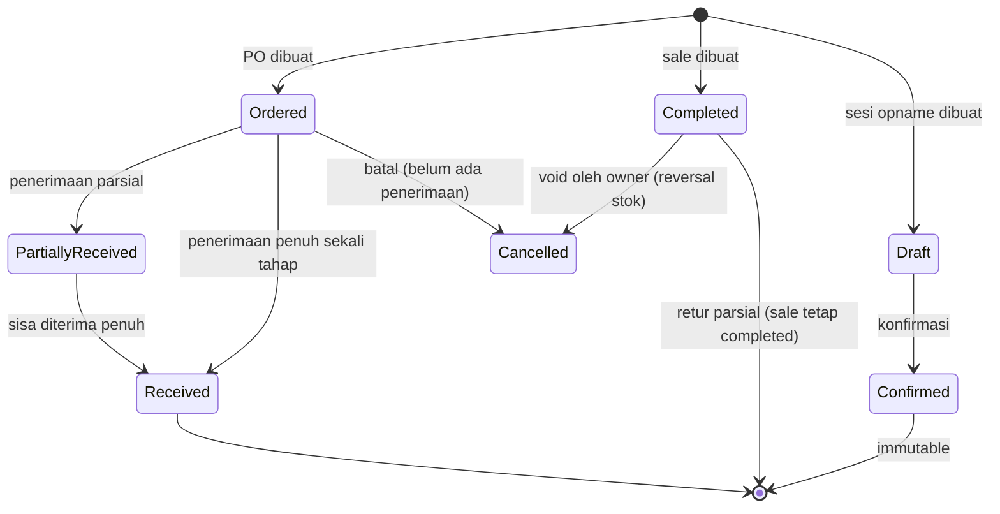

## 11. Deployment Diagram

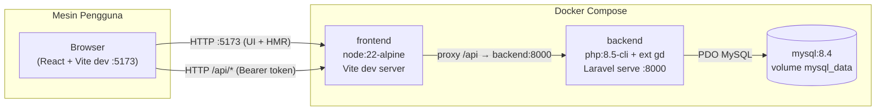
